| Name | Image | Upgraded image | Rarity | Type | Cost | Description |
| ---- | ----- | -------------- | ------ | ---- | ---- | ----------- |
| Defend | 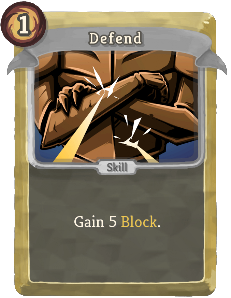 | 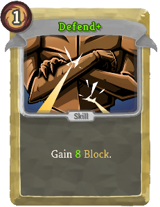 | Basic | Skill | 1 | Gain 5 (8) Block. |
| Goto | 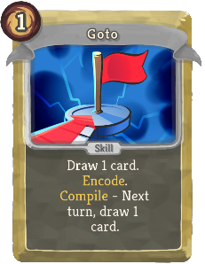 |  | Basic | Skill | 1 | Draw 1 (2) card(s). bronze:Encode. bronze:Compile - Next turn, draw 1 (2) card(s). |
| Replicate | 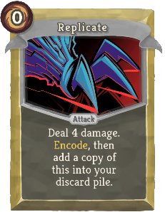 | 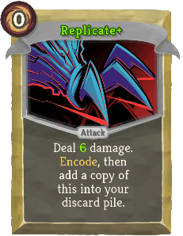 | Basic | Attack | 0 | Deal 4 (6) damage. bronze:Encode, then add a copy of this into your discard pile. |
| Strike |  | 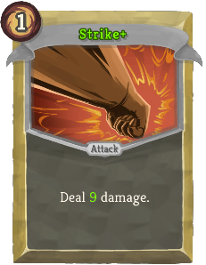 | Basic | Attack | 1 | Deal 6 (9) damage. |
| function() | .png) |  | Special | Skill | 0 |  |
| Bit Shift |  | 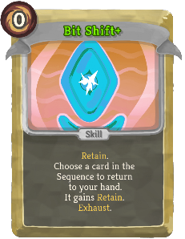 | Common | Skill | 0 | (Retain.)  Choose a card in the Sequence to return to your hand. It gains Retain. Exhaust. |
| Branch | 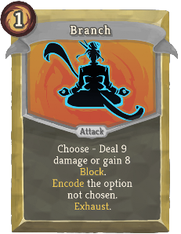 | 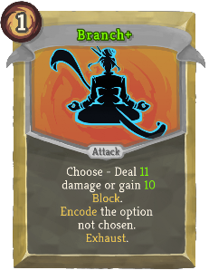 | Common | Attack | 1 | Choose - Deal 9 (11) damage or gain 8 (10) Block. bronze:Encode the option not chosen. Exhaust. |
| Bug Barrage | 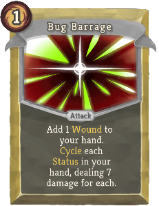 | 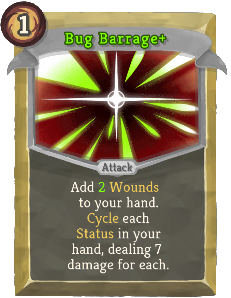 | Common | Attack | 1 | Add 1 (!M!) Wound(s) to your hand. bronze:Cycle each Status in your hand, dealing 7 damage for each. |
| Buggy Mess | 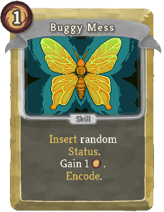 | 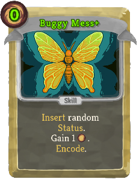 | Common | Skill | 1 (0) | bronze:Insert random Status. Gain 1 [E] . bronze:Encode. |
| Constructor |  | 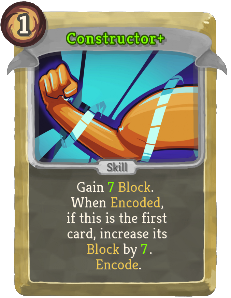 | Common | Skill | 1 | Gain 5 (7) Block. π When bronze:Encoded, if this is the first card, increase its Block by 5 (7). bronze:Encode. |
| Cut Through | 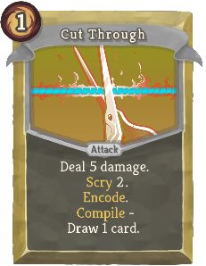 | 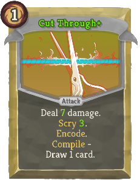 | Common | Attack | 1 | Deal 5 (7) damage. Scry 2 (3). bronze:Encode. bronze:Compile - Draw 1 card. |
| Delayed Guard | 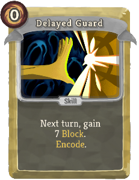 | 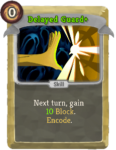 | Common | Skill | 0 | Next turn, gain 7 (10) Block. bronze:Encode. |
| Delayed Slice | 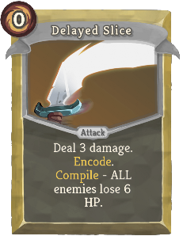 | 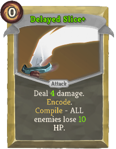 | Common | Attack | 0 | Deal 3 (4) damage. bronze:Encode. bronze:Compile - ALL enemies lose 6 (10) HP. |
| Deprecate | 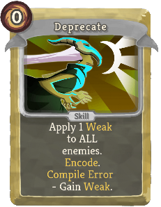 | 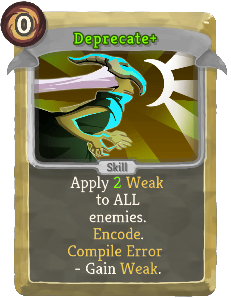 | Common | Skill | 0 | Apply 1 (2) Weak to ALL enemies. bronze:Encode. bronze:Compile Error - Gain Weak. |
| Fine Tuning | 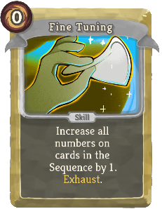 |  | Common | Skill | 0 | (Retain.)  Increase all numbers on cards in the Sequence by 1. Exhaust. |
| Frontload | 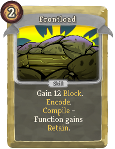 | 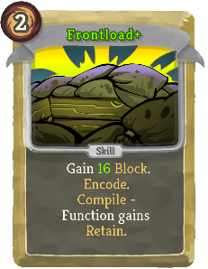 | Common | Skill | 2 | Gain 12 (16) Block. bronze:Encode. bronze:Compile - Function gains Retain. |
| Invalidate | 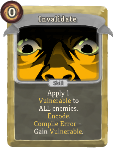 | 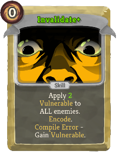 | Common | Skill | 0 | Apply 1 (2) Vulnerable to ALL enemies. bronze:Encode. bronze:Compile Error - Gain Vulnerable. |
| Iterate | 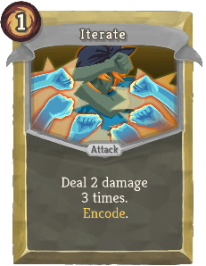 | 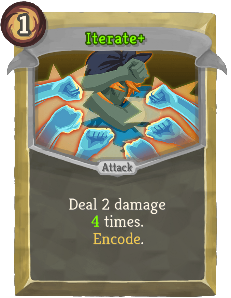 | Common | Attack | 1 | Deal 2 damage 3 (4) times. bronze:Encode. |
| Oil Spill | 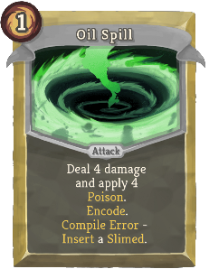 | 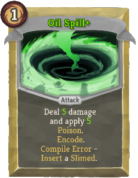 | Common | Attack | 1 | Deal 4 (5) damage and apply 4 (5) Poison. bronze:Encode. bronze:Compile Error - bronze:Insert a Slimed. |
| Overheat |  | 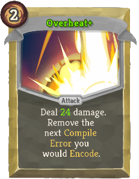 | Common | Attack | 2 | Deal 18 (24) damage. Remove the next bronze:Compile Error you would bronze:Encode. |
| Piercing Shot | 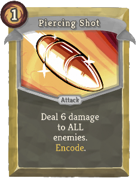 | 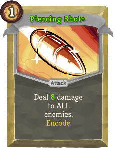 | Common | Attack | 1 | Deal 6 (8) damage to ALL enemies. bronze:Encode. |
| Separator | 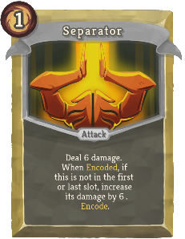 | 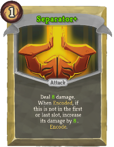 | Common | Attack | 1 | Deal 6 (8) damage. π When bronze:Encoded, if this is not in the first or last slot, increase its damage by 6 (8). bronze:Encode. |
| Sticky Shield | 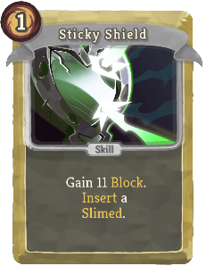 |  | Common | Skill | 1 | Gain 11 (14) Block. bronze:Insert a Slimed. |
| Turbo | 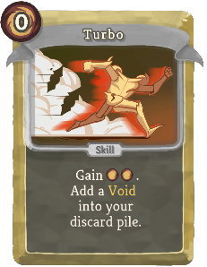 | 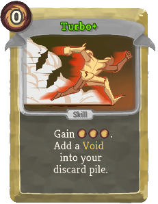 | Common | Skill | 0 | Gain [E] [E] ([E]). Add a Void into your discard pile. |
| Wild Beam | 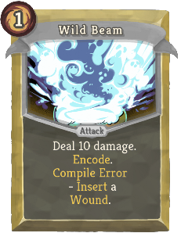 |  | Common | Attack | 1 | Deal 10 (13) damage. bronze:Encode. bronze:Compile Error - bronze:Insert a Wound. |
| Allocate | 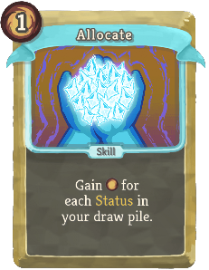 | 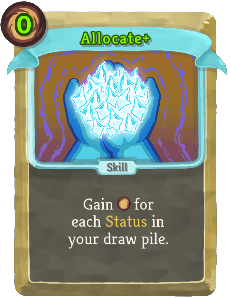 | Uncommon | Skill | 1 (0) | Gain [E] for each Status in your draw pile. |
| Backtrace | 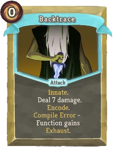 | 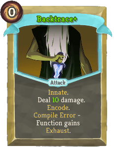 | Uncommon | Attack | 0 | Innate.   Deal 7 (10) damage. bronze:Encode. bronze:Compile Error - Function gains Exhaust. |
| Blockchain | 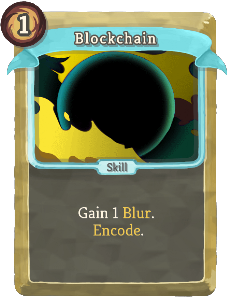 | 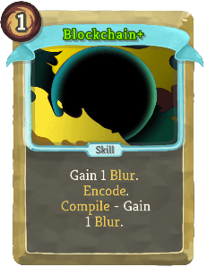 | Uncommon | Skill | 1 | Gain 1 bronze:Blur. bronze:Encode.  (bronze:Compile - Gain 1 bronze:Blur.) |
| Boost | 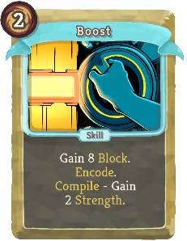 | 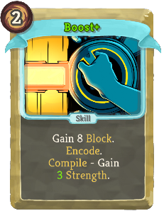 | Uncommon | Skill | 2 | Gain 8 Block. bronze:Encode. bronze:Compile - Gain 2 (3) Strength. |
| Bronze Armor | 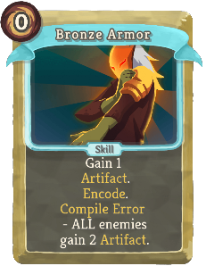 | 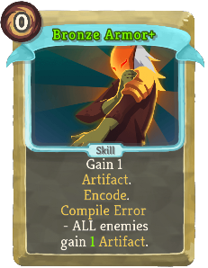 | Uncommon | Skill | 0 | Gain 1 Artifact. bronze:Encode. bronze:Compile Error - ALL enemies gain 2 (1) Artifact. |
| Bronze Orb |  |  | Uncommon | Attack | 1 | Innate. Deal 6 (9) damage. Gain 6 (9) Block. bronze:Encode a random card with bronze:Encode in your draw pile. Exhaust. |
| Class Default |  |  | Uncommon | Power | 1 | (Retain.)  Add a copy of the first card in the current Sequence to the next 2 Sequences automatically. |
| Cultist Strike |  |  | Uncommon | Attack | 1 | Deal 6 (9) damage. bronze:Encode. bronze:Compile - Increase this card's damage by 1 permanently. |
| Dark Dash |  |  | Uncommon | Attack | 2 | Gain 8 (10) Block. Deal 8 (10) damage. bronze:Encode. bronze:Compile Error - bronze:Insert a Void. |
| Digital Carnage |  |  | Uncommon | Attack | 2 | Deal 20 (28) damage. bronze:Encode. bronze:Compile Error - Function is Ethereal. |
| Flail |  |  | Uncommon | Attack | 2 | Deal 6 (7) damage to ALL enemies 2 times. bronze:Encode. bronze:Compile - Gain 1 (2) Artifact. |
| Follow Through |  |  | Uncommon | Attack | 1 | Deal 7 (9) damage. Gain 4 (6) Block. If the last played card was a Function, play this again. |
| For Loop |  |  | Uncommon | Skill | X | (Retain.)  The next card you bronze:Encode causes X additional copies to also be bronze:Encoded. Exhaust. |
| Force Shield |  |  | Uncommon | Skill | 4 | Costs 1 less [E] for each Function created this combat. Gain 12 (16) Block. |
| Fortify |  |  | Uncommon | Attack | 2 | Deal 8 damage. bronze:Encode. bronze:Compile - Gain 2 (3) Dexterity. |
| Get Latest |  |  | Uncommon | Skill | 1 (0) | Add a random card with bronze:Encode to your hand. It costs 0. Exhaust. |
| Infinite Beams |  |  | Uncommon | Power | 1 | At the start of each turn, add a Minor Beam (*Beam+) to your hand. |
| Invoke |  |  | Uncommon | Skill | 0 | Gain 3 (5) Block. bronze:Encode. bronze:Compile - Gain [E] equal to the total cost of cards in the Sequence. |
| It's a Feature |  |  | Uncommon | Power | 1 | (Innate.)  Whenever you draw a Curse or Status card, gain 1 Temporary Strength and Dexterity. |
| Max Output |  |  | Uncommon | Power | 1 (0) | Draw 3 cards. At the start of each turn, draw 1 additional card and bronze:Insert 1 Dazed. |
| Merge Conflict |  |  | Uncommon | Attack | 2 | Deal 10 damage. The next time you bronze:Encode a card, bronze:Encode a copy of it. Exhaust. (not Exhaust.) |
| Null Pointer |  |  | Uncommon | Attack | 1 | Deal 12 (15) damage. Gain 12 (15) Block. bronze:Encode. bronze:Compile Error - Function is Unplayable. |
| Optimize |  |  | Uncommon | Power | 0 | Upgrade the next 3 (5) cards you bronze:Encode that can be upgraded. |
| Overload |  |  | Uncommon | Skill | 1 | Play a copy of each card in the Sequence. They do not Encode. Exhaust. (not Exhaust.) |
| Philosophize |  |  | Uncommon | Skill | 1 | Gain 1 Strength. bronze:Encode. bronze:Compile Error - ALL enemies gain 2 (1) Strength. |
| Refactor |  |  | Uncommon | Skill | 1 | Scry 4. Exhaust all cards discarded. Gain 4 (6) Block for each Status card exhausted. |
| Repair |  |  | Uncommon | Skill | 1 | Gain 4 Block. bronze:Encode. bronze:Compile - Heal 7 (10) HP. |
| Repulsor |  |  | Uncommon | Power | 2 (1) | When you draw the first Status or Curse card each turn, Exhaust it and draw a card. |
| Return |  |  | Uncommon | Skill | X | Gain [E] and draw 1 additional card at the start of your next X turns. Gain [E]. Exhaust. (not Exhaust.) |
| Safeguard |  |  | Uncommon | Skill | 1 | Gain 10 (13) Block. bronze:Encode. bronze:Compile Error - Gain 2 Frail. |
| Terminator |  |  | Uncommon | Skill | 1 (0) | bronze:Encode. bronze:Compile - If this is the last card in the Sequence, Function gains 'Play this again'. |
| Assembly |  |  | Rare | Skill | 1 | Scry 5 (8). bronze:Encode all cards with bronze:Encode discarded in selected order. Exhaust. |
| Break |  |  | Rare | Attack | 1 | Deal 15 (18) damage. bronze:Encode. bronze:Compile Error - bronze:Insert 4 (3) random Status cards. |
| Burn Out |  |  | Rare | Attack | 2 | Deal 5 (8) damage to a random enemy for ALL of your Status cards, then Exhaust them. bronze:Insert 3 Burns. |
| Clean Code |  |  | Rare | Power | 2 | Remove all bronze:Compile Error effects from cards in the Sequence. Lasts for the next 3 (4) Functions created. |
| Dev Tools |  |  | Rare | Skill | 0 | Retain. Choose between Debug, Batch, Decompile, and Byte Shift. Exhaust. (not Exhaust.) |
| Early Access |  |  | Rare | Attack | 1 | (Innate.  ) Deal 13 damage. bronze:Insert random Status. bronze:Encode. bronze:Compile - bronze:Insert Beta Build. |
| Find and Replace |  |  | Rare | Skill | 0 | Ethereal (Retain). Fetch a card from your draw or discard pile. Add a Dazed where it was. Exhaust. |
| Format |  |  | Rare | Skill | X | bronze:Encode X (X+1) copies of Fragment. Gain [E]. Exhaust. |
| HYPER BEAM |  |  | Rare | Attack | 6 (5) | Retain. Deal 45 damage to ALL enemies. Put 5 Void on top of your draw pile. When Retained, lower its cost by 1 this combat. |
| Hardcode |  |  | Rare | Power | 3 (0) | Next time you create a Function, add it to your deck. Remove the cards used to create it (including this). |
| Infinite Loop |  |  | Rare | Attack | 1 | Deal 6 damage. bronze:Encode. bronze:Compile - Add a copy of this into your hand and increase its damage by 2 (3). |
| Library |  |  | Rare | Power | 3 (2) | At the start of your turn, add a random card with bronze:Encode to your hand. It costs 0. |
| Mutator |  |  | Rare | Power | 1 | (Retain.)  Gain 1 Strength. Transform a Status in your hand into a copy of this. |
| Recursive Strike |  |  | Rare | Attack | 2 | Deal 6 (9) damage 2 times. bronze:Encode. bronze:Compile - bronze:Encode 2 copies of Strike (*Strike+). |
| Sentient Form |  |  | Rare | Power | 3 | Ethereal. (not Ethereal.) The first time you create or draw a Function each turn, increase all numbers on it by 1. |
| Ship It |  |  | Rare | Attack | 1 | Deal 5 damage. Deals 2 (3) additional damage for ALL of your Status cards. |
| Spaghetti Code |  |  | Rare | Skill | 2 (1) | Until the Sequence is full, choose 1 of 3 random cards to bronze:Encode. Exhaust. |
| Summon Orb |  |  | Rare | Power | 2 | Whenever you create or play a Function, gain 4 (6) Block and deal 4 (6) damage to a random enemy. |
| Thunder Wave |  |  | Rare | Attack | 2 | Deal 7 (9) damage to a random enemy for each Function created this combat. |
| Virus |  |  | Rare | Attack | 1 | Retain. Deal 3 (4) damage. Transform all cards in hand into Minor Beam (*Beam+). Exhaust. |
