| Name | Image | Upgraded image | Rarity | Type | Cost | Description |
| ---- | ----- | -------------- | ------ | ---- | ---- | ----------- |
| Defend |  | 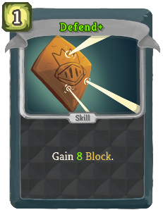 | Basic | Skill | 1 | Gain 5 (8) Block. |
| Execute |  | 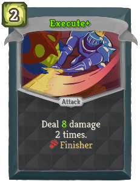 | Basic | Attack | 2 | Deal 6 (8) damage 2 times. [fist_icon]   champ:Finisher |
| Strike | 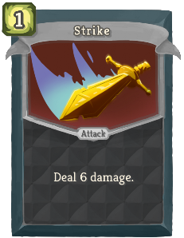 | 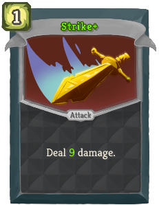 | Basic | Attack | 1 | Deal 6 (9) damage. |
| Taunt | 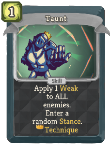 | 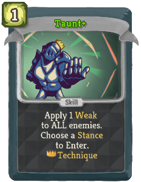 | Basic | Skill | 1 | Apply 1 Weak to ALL enemies. Enter (Choose) a random (not random)Stance (to Enter). [crown_icon] champ:Technique NL |
| Adrenal Armor | 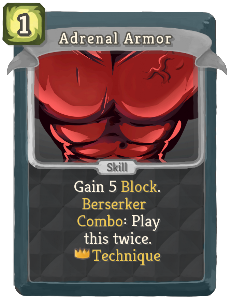 | 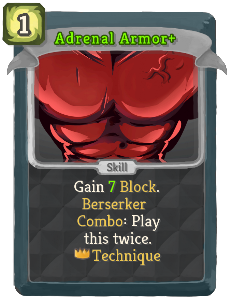 | Common | Skill | 1 | Gain 5 (7) Block. Berserker champ:Combo: Play this twice. [crown_icon]   champ:Technique  |
| Backstep |  |  | Common | Skill | 1 (0) | Enter champ:Defensive. Gain 6 Block. Berserker champ:Combo: Gain Block equal to your Vigor. |
| Berserker's Shout | 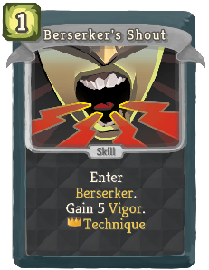 | 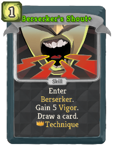 | Common | Skill | 1 | Enter champ:Berserker. Gain 5 Vigor. (Draw a card.)  [crown_icon] champ:Technique NL |
| Bring It On | 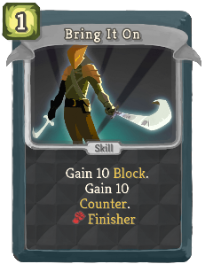 | 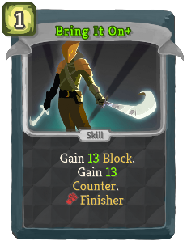 | Common | Skill | 1 | Gain 10 (13) Block. Gain 10 (13) champ:Counter. [fist_icon]   champ:Finisher |
| Chain Lash | 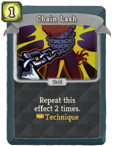 | 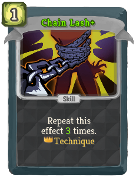 | Common | Skill | 1 | Repeat this effect 2 (3) times. [crown_icon]   champ:Technique  |
| Circumvent | 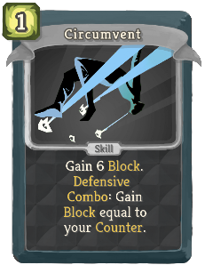 | 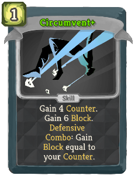 | Common | Skill | 1 | Gain (!M! champ:Counter. Gain) 6 Block. Defensive champ:Combo: Gain Block equal to your champ:Counter. |
| Crownarang | 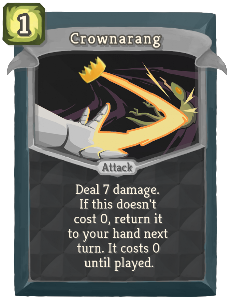 | 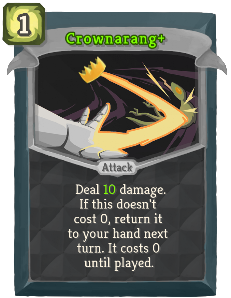 | Common | Attack | 1 | Deal 7 (10) damage. If this doesn't cost 0, return it to your hand next turn. It costs 0 until played. |
| Defensive Shout | 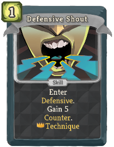 | 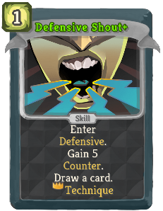 | Common | Skill | 1 | Enter champ:Defensive. Gain 5 champ:Counter. (Draw a card.)  [crown_icon] champ:Technique NL |
| En Garde | 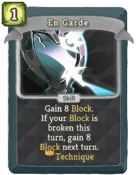 | 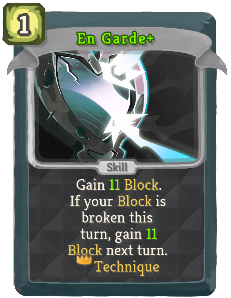 | Common | Skill | 1 | Gain 8 (11) Block. If your Block is broken this turn, gain 8 (11) Block next turn. [crown_icon]   champ:Technique  |
| Fan of Knives | 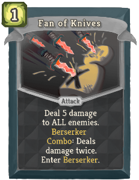 | 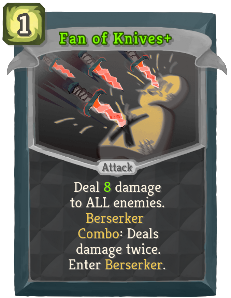 | Common | Attack | 1 | Deal 5 (8) damage to ALL enemies. Berserker champ:Combo: Deals damage twice. Enter champ:Berserker. |
| Flash Strike | 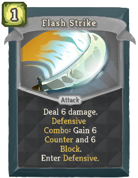 | 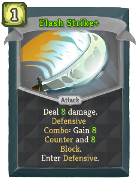 | Common | Attack | 1 | Deal 6 (8) damage. Defensive champ:Combo: Gain 6 (8) champ:Counter and 6 (8) Block. Enter champ:Defensive. |
| Flurry of Strikes | 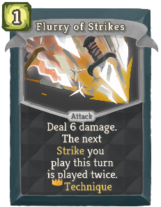 | 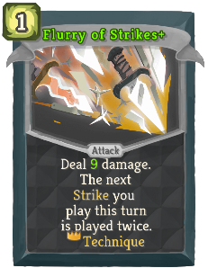 | Common | Attack | 1 | Deal 6 (9) damage. The next Strike you play this turn is played twice. [crown_icon]   champ:Technique  |
| Gut Punch | 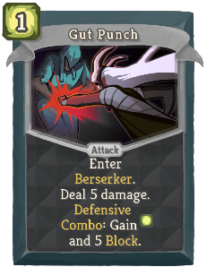 | 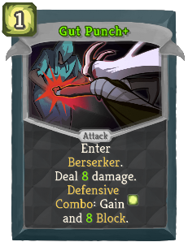 | Common | Attack | 1 | Enter champ:Berserker. Deal 5 (8) damage. Defensive champ:Combo: Gain [E] and 5 (8) Block. |
| Perfected Strike | 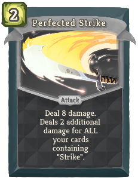 | 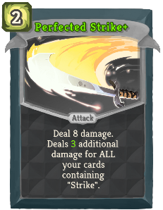 | Common | Attack | 2 | Deal 8 damage. Deals 2 (3) additional damage for ALL your cards containing "Strike". |
| Piledriver | 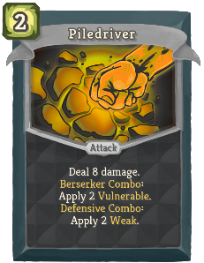 | 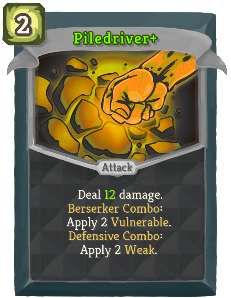 | Common | Attack | 2 | Deal 8 (12) damage. Berserker champ:Combo: Apply 2 Vulnerable. Defensive champ:Combo: Apply 2 Weak. |
| Precise Thrust | 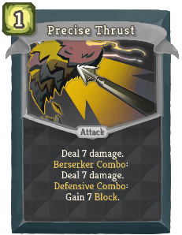 | 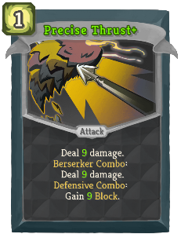 | Common | Attack | 1 | Deal 7 (9) damage. Berserker champ:Combo: Deal 7 (9) damage. Defensive champ:Combo: Gain 7 (9) Block. |
| Shatter | 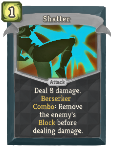 | 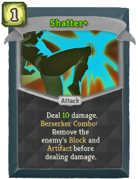 | Common | Attack | 1 | Deal 8 (10) damage. Berserker champ:Combo: Remove the enemy's Block (and Artifact) before dealing damage. |
| Stance Dance | 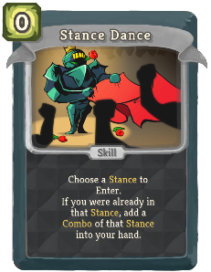 |  | Common | Skill | 0 | Choose a Stance to Enter. If you were already in that Stance, add (Add) a champ:Combo of that Stance into your hand. |
| Tornado Punch | 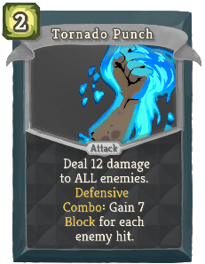 | 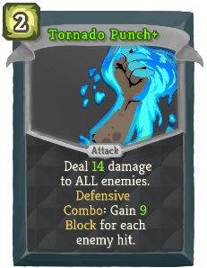 | Common | Attack | 2 | Deal 12 (14) damage to ALL enemies. Defensive champ:Combo: Gain 7 (9) Block for each enemy hit. |
| Arena Preparation | 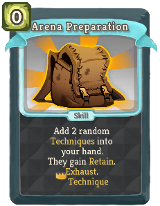 | 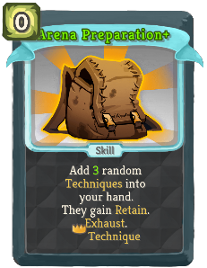 | Uncommon | Skill | 0 | Add 2 (3) random champ:Techniques into your hand. They gain Retain. Exhaust. [crown_icon]   champ:Technique  |
| Battle Plan | 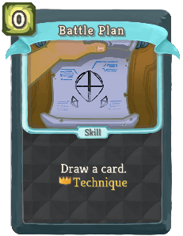 | 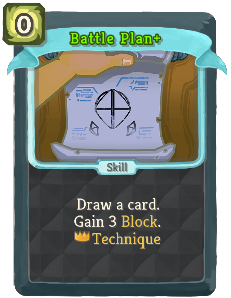 | Uncommon | Skill | 0 | Draw a card. (Gain !B! Block.)  [crown_icon] champ:Technique NL |
| Berserker Style | 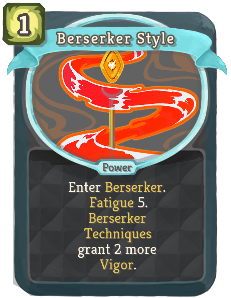 | 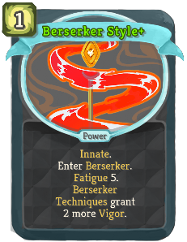 | Uncommon | Power | 1 | (Innate.)  Enter champ:Berserker. champ:Fatigue 5. champ:Berserker champ:Techniques grant 2 more Vigor. |
| Crooked Strike |  | 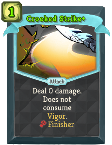 | Uncommon | Attack | 2 (1) | Deal 0 damage. Does not consume Vigor. [fist_icon]   champ:Finisher |
| Death Blow | 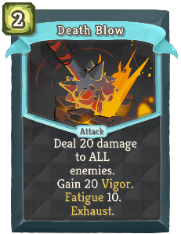 | 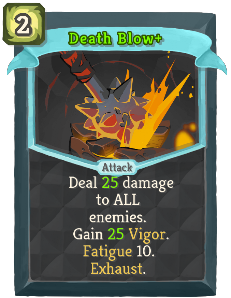 | Uncommon | Attack | 2 | Deal 20 (25) damage to ALL enemies. Gain 20 (25) Vigor. champ:Fatigue 10. Exhaust. |
| Defensive Style |  |  | Uncommon | Power | 1 | (Innate.)  Enter champ:Defensive. champ:Fatigue 5. (not champ:Fatigue 5.) champ:Defensive Techniques grant 2 more champ:Counter. |
| Duel |  |  | Uncommon | Attack | 2 | Gain 7 (10) Block. Deal 7 (10) damage. If there's only one enemy, play this twice. [crown_icon]   champ:Technique  |
| Encircle |  |  | Uncommon | Attack | 1 | Deal 7 (10) damage to ALL enemies. For each enemy hit: [crown_icon]   champ:Technique  |
| Endure |  |  | Uncommon | Skill | 1 | Gain 7 (10) Block. This card's Block is increased by Strength instead of Dexterity (not instead of Dexterity). [crown_icon] champ:Technique NL |
| Enraged Bash |  |  | Uncommon | Attack | 1 | Deal 5 (8) damage. Berserker champ:Combo: This card hits an additional time this combat. |
| Face Slap |  |  | Uncommon | Attack | 1 | Deal 9 (11) damage, twice if enemy is Vulnerable. Berserker champ:Combo: Apply 2 (3) Vulnerable. |
| False Counter |  |  | Uncommon | Skill | 1 | (Gain !M! champ:Counter.)  The next time champ:Counter activates, lose only half. [fist_icon] champ:Finisher |
| Fancy Footwork |  |  | Uncommon | Skill | 0 | Requires Defensive or Berserker. Enter the Stance you aren't in. Draw 1 (2) card(s). |
| Finish Him |  |  | Uncommon | Attack | 1 | Can only be used against an enemy with less than 50% HP. Deal 20 (30) damage. |
| Focus: Berserker |  |  | Uncommon | Skill | 0 | Enter champ:Berserker. The next time you use a champ:Finisher this turn, deal 10 (15) damage to ALL enemies. [crown_icon]   champ:Technique  |
| Focus: Defensive |  |  | Uncommon | Skill | 0 | Enter champ:Defensive. The next time you use a champ:Finisher this turn, gain 10 (15) Block. [crown_icon]   champ:Technique  |
| Good Clean Fight |  |  | Uncommon | Power | 1 | champ:Fatigue 10. Gain 2 (3) Strength and Dexterity. |
| Iron Fortress |  |  | Uncommon | Power | 2 | Gain 2 Dexterity. At the end of each turn, gain 3 (6) Block. |
| Lariat |  |  | Uncommon | Skill | X | Perform X times: (times, then gain [E] :) Gain 5 Block. [crown_icon] champ:Technique NL |
| Moment of Truth |  |  | Uncommon | Skill | 0 | Retain. (Draw 1 card.)  [fist_icon] champ:Finisher |
| Parry |  |  | Uncommon | Skill | 2 | Gain 10 (16) champ:Counter. If your champ:Counter is used this turn, add Riposte to your hand. |
| Preemptive Strike |  |  | Uncommon | Attack | 1 (0) | Deal damage equal to your champ:Counter to ALL enemies. Lose half of your champ:Counter. |
| Rapid Strikes |  |  | Uncommon | Attack | 1 | Deal 4 (6) damage 2 times. Reduce the cost of a random Strike in your hand to 0 this turn. |
| Reckless Strike |  |  | Uncommon | Attack | 2 | Deal 18 (20) damage. Perform 3 (4) times: [crown_icon]   champ:Technique  |
| Refreshment |  |  | Uncommon | Skill | 1 | *Berserker champ:Combo: Gain [E] [E] ([E]), then Exhaust this. Defensive champ:Combo: Draw 3 (4) cards. |
| Rising Strike |  |  | Uncommon | Attack | 1 | Deal 7 (10) damage. Play this twice if the last played card was a champ:Technique. [crown_icon]   champ:Technique  |
| Set A Trap |  |  | Uncommon | Skill | 1 | Gain 6 (8) Block, twice if any enemy is Weak. Defensive champ:Combo: Apply 2 (3) Weak to ALL enemies. |
| Sigil of Victory |  |  | Uncommon | Skill | 0 | Repeat this effect 2 (4) times. Exhaust. [crown_icon]   champ:Technique  |
| Skillful Dodge |  |  | Uncommon | Skill | 1 | Gain 4 Block. Gain 4 champ:Counter. Defensive champ:Combo: Increase this card's effects by 2 (4) this combat. |
| Technical Jig |  |  | Uncommon | Power | 1 | (Innate.)  Whenever you enter a Stance: [crown_icon] champ:Technique NL |
| Vicious Mockery |  |  | Uncommon | Skill | 0 | *Berserker champ:Combo: Gain 3 (5) temporary Strength. Defensive champ:Combo: Gain 3 (5) temporary  Dexterity. |
| Wind Up |  |  | Uncommon | Skill | 0 | Choose a Stance to Enter. Fetch a champ:Finisher from your draw pile. Exhaust. (not Exhaust.) |
| Cheap Shot |  |  | Rare | Attack | 2 (1) | Deal 5 damage. If the enemy is a Boss, deal damage two more times. If not, stun it. Exhaust. |
| Clobber |  |  | Rare | Attack | 1 | Deal 10 (13) damage. Berserker champ:Combo: Gain [E] . Defensive champ:Combo: Gain Block equal to unblocked damage dealt. |
| Dancing Master |  |  | Rare | Power | 1 | The third time you enter a Stance each turn, gain [E] ([E]) and draw 2 cards. |
| Devastate |  |  | Rare | Attack | 5 | Deal 24 (32) damage. Costs 1 less [E] for each Finisher played this combat. [fist_icon]   champ:Finisher |
| Enchant Crown |  |  | Rare | Skill | 1 (0) | champ:Fatigue 5. Choose a card in hand. It costs 0 this combat. Exhaust. |
| Enchant Shield |  |  | Rare | Skill | 1 (0) | champ:Fatigue 5. Choose a card in hand. Increase its Block by 8 for this combat. Exhaust. |
| Enchant Sword |  |  | Rare | Skill | 1 (0) | champ:Fatigue 5. Choose a card in hand. Increase its damage by 8 for this combat. Exhaust. |
| Gladiator Form |  |  | Rare | Power | 3 (2) | Whenever you use a champ:Technique Bonus, draw a card. Whenever you use a champ:Finisher Bonus, gain [E] next turn. |
| Hold Firm |  |  | Rare | Skill | 2 | Gain 15 (20) Block. Gain 10 (15) champ:Counter. Gain 1 bronze:Blur. |
| Ignore Pain |  |  | Rare | Skill | 2 (1) | champ:Fatigue 5. Your HP cannot be reduced until your next turn. Exhaust. |
| Improvising |  |  | Rare | Power | 2 (1) | The first time you use a champ:Combo each turn, return it to your hand. It costs 0 until played. |
| Last Stand |  |  | Rare | Power | 1 (0) | Can only be played if you're under 50% HP. Remove all debuffs. Gain 6 Strength. [fist_icon]   champ:Finisher |
| Masterful Slash |  |  | Rare | Attack | 2 | Deal 10 (13) damage. Add a random (Upgraded) champ:Technique to your hand. It costs 0. |
| Murder Strike |  |  | Rare | Attack | 8 (6) | Retain. Deal 15 (21) damage. When you use a champ:Technique, this card costs 1 less and deals 3 more damage. Exhaust. |
| Shield Throw |  |  | Rare | Attack | 1 | Gain 9 (13) Block. Deal damage equal to your Block. Unless Defensive champ:Combo: You can't gain Block next turn. |
| Steel Edge |  |  | Rare | Attack | X | *Berserker champ:Combo: Deal 9 (12) damage X times. Defensive champ:Combo: Gain 9 (12) Block X times. |
| Strike of Genius |  |  | Rare | Power | 2 | At the start of your turn, add a random (Upgraded) card containing "Strike" into (to) your hand. It costs 0 until played and gains Exhaust. |
| Sword Throw |  |  | Rare | Attack | 1 | Deal 8 (11) damage 2 times. Unless Berserker champ:Combo: You can't attack next turn. |
| Triple Strike |  |  | Rare | Attack | 2 | Deal 6 (9) damage. Add 2 (Upgraded) Strikes into your hand. They cost 0 and have champ:Technique. Exhaust. |
| Ultimate Stance |  |  | Rare | Skill | 1 | Requires Defensive or Berserker. Enter champ:Ultimate Stance for 1 (!M!) turn(s). [crown_icon] champ:Technique NL |
