| Name | Image | Upgraded image | Rarity | Type | Cost | Description |
| ---- | ----- | -------------- | ------ | ---- | ---- | ----------- |
| Change of Pace | 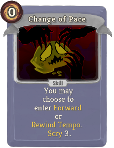 | 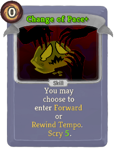 | Basic | Skill | 0 | You may choose to enter timeeatermod:Forward or timeeatermod:Rewind_Tempo. Scry 3 (5). |
| Defend | 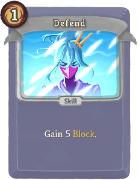 | 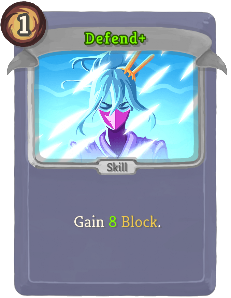 | Basic | Skill | 1 | Gain 5 (8) Block. |
| Hiccup |  | 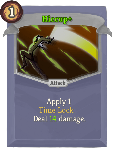 | Basic | Attack | 1 | Apply 1 timeeatermod:Time_Lock. Deal 9 (14) damage. |
| Strike | 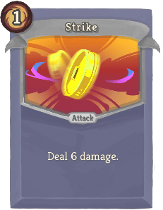 | 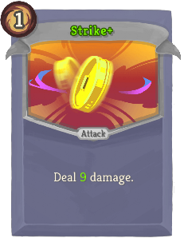 | Basic | Attack | 1 | Deal 6 (9) damage. |
| Auto-Generated Next Turn Power | 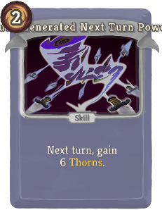 | 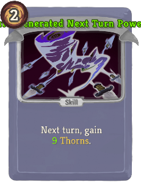 | Special | Skill | 2 | Next turn, gain 6 (9) Thorns. |
| Auto-Generated Temporary Power | 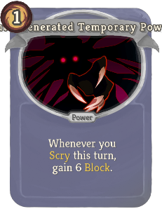 | 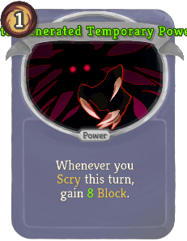 | Special | Power | 1 | Whenever you Scry this turn, gain 6 (8) Block. |
| Card Parsing, Card Selection, Card Mods |  | 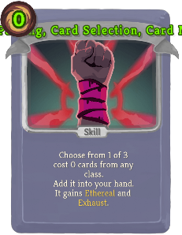 | Special | Skill | 1 (0) | Choose from 1 of 3 cost 0 cards from any class. Add it into your hand. It gains Ethereal and Exhaust. |
| Carpe Diem |  | 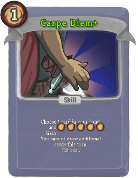 | Special | Skill | 1 | Choose 1 card in your hand, and discard the rest. Gain [E] [E] [E] ([diffAddS]) [E] ([diffAddE] [E]). You cannot draw additional cards this turn. Exhaust. |
| DiscardAllAttack | 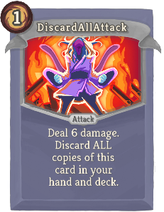 | 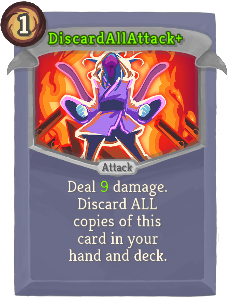 | Special | Attack | 1 | Deal 6 (9) damage. Discard ALL copies of this card in your hand and deck. |
| Easy Modal Choice | 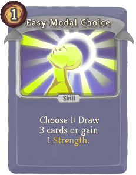 | 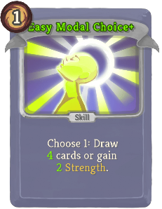 | Special | Skill | 1 | Choose 1: Draw 3 (4) cards or gain 1 (2) Strength. |
| Easy X Cost | 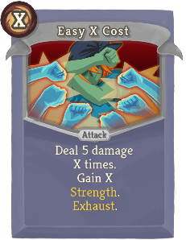 | 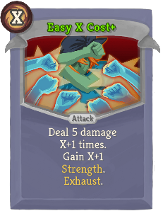 | Special | Attack | X | Deal 5 damage X ([diffAddS] X+1 [diffAddE]) times. Gain X ([diffAddS] X+1 [diffAddE]) Strength. Exhaust. |
| Haste |  |  | Special | Power | 2 (1) | placeholder, no effect yet |
| Inline Card Mods |  |  | Special | Skill | 1 (0) | Add a random Strike of any color to your hand. Enchant it with "Kills Spikers." |
| Inline Power |  |  | Special | Power | 1 | Strikes deal 4 (6) more damage. At the end of your turn, gain 4 (6) Block. |
| Multiple Previews - One Card |  |  | Special | Skill | 2 | Ethereal. Add a random ([diffAddS] Upgraded [diffAddE]) Stinky Watcher Buddy into your hand. Exhaust. |
| One Time Rewind |  |  | Special | Skill | 0 | It's rewind time! Yaaaa. This is a debug card tbh. |
| Recurring Strike |  |  | Special | Attack | 0 | Deal 5 (8) damage. Double this card's damage, increase its cost by 1, and return it to your hand. |
| TimeLockVulnerable |  |  | Special | Attack | 1 | Deal 7 (10) damage. If the target has timeeatermod:Time_Lock, apply 2 Vulnerable. |
| TimeLockWeak |  |  | Special | Attack | 1 | Deal 7 (10) damage. If the target has timeeatermod:Time_Lock, apply 2 Weak. |
| Warp Form |  |  | Special | Power | 3 (1) | Whenever you draw, gain [E]. |
| Wasting Time |  |  | Special | Skill | 0 | Draw 1 (2) ([diffAddS]) card(s). ([diffAddE]) Exhaust. |
| BlurCard |  |  | Common | Skill | 1 | Gain 5 (8) Block. Gain 1 bronze:Blur. |
| Borrowed Time |  |  | Common | Skill | 0 | Gain [E] ([diffAddS]) [E] ([diffAddE] [E]). The next card you draw will be a Void. |
| Echoing Guard |  |  | Common | Skill | 1 | Gain 7 (10) Block. If you have timeeatermod:Time_Lock, gain 7 (10) additional Block. |
| Fall Back |  |  | Common | Skill | 1 | Gain 8 (11) Block. Enter timeeatermod:Rewind_Tempo. |
| Fleeting Dexterity |  |  | Common | Skill | 0 | Gain 2 (3) Dexterity. Lose 2 (3) Dexterity the next time you lose HP. |
| Fleeting Strength |  |  | Common | Skill | 0 | Gain 2 (3) Strength. Lose 2 (3) Strength the next time you lose HP. |
| Forward Thinking |  |  | Common | Skill | 1 (0) | If in timeeatermod:Forward_Tempo: Draw 2 Cards. Otherwise, enter timeeatermod:Forward_Tempo. |
| Hold Your Breath |  |  | Common | Skill | 1 | Gain 1 timeeatermod:Time_Lock. Gain 5 (8) Block. |
| Knock Out Punch |  |  | Common | Attack | 1 | Apply 2 timeeatermod:Time_Lock. Deal 18 (21) damage. |
| Quick Slash |  |  | Common | Attack | 1 | Deal 8 (12) damage. Draw 1 card. |
| Record Scratch |  |  | Common | Attack | 1 | Deal 8 (11) damage. Apply 1 (2) Weak. |
| Relive The Past |  |  | Common | Skill | 1 (0) | If in timeeatermod:Rewind_Tempo: Draw 2 Cards. Otherwise, enter timeeatermod:Rewind_Tempo. |
| Reverse Grip |  |  | Common | Attack | 1 | Deal 8 (11) damage. Switch Tempo. |
| Slug It Off |  |  | Common | Skill | 1 | Gain 8 (11) Block. Draw 1 card. timeeatermod:Forget 5 damage. |
| Spare Time |  |  | Common | Skill | 1 (0) | Gain [E]. Whenever you draw this card, increase its [E] by 1 until played. |
| Spring Forward |  |  | Common | Attack | 1 | Deal 9 (12) damage. Enter timeeatermod:Forward_Tempo. |
| Third Eye |  |  | Common | Skill | 1 | Gain 7 (10) Block. Scry 3. |
| Wake-Up Slap |  |  | Common | Attack | 1 | Deal 3 damage. Reduce the duration of timeeatermod:Time_Lock on the enemy by 1 (2). |
| After Image |  |  | Uncommon | Power | 2 (1) | Whenever you play a card, gain -1 Block. |
| Blueshift |  |  | Uncommon | Skill | 1 (0) | Take double damage this turn. Gain 1 Intangible next turn. Exhaust. |
| Butterfly Effect |  |  | Uncommon | Power | 2 (1) | Each time an enemy's timeeatermod:Time_Lock expires, it affects ALL enemies. |
| Channel Surfing |  |  | Uncommon | Skill | 0 | Shuffle 3 (4) Wasting Time into your draw pile. |
| Daylight Savings |  |  | Uncommon | Skill | 0 | Energy is conserved for next turn. |
| Deja Vu |  |  | Uncommon | Attack | 0 | Deal 4 (6) damage. Whenever you change Tempo, add this card from your Exhaust Pile to your hand. Exhaust. |
| Desync |  |  | Uncommon | Power | 2 (1) | Gain 1 timeeatermod:Time_Lock. Whenever your timeeatermod:Time_Lock wears off, gain 1 timeeatermod:Time_Lock. |
| Endless Memory |  |  | Uncommon | Attack | 1 | Deal 7 (10) damage. Return this card to your hand. Cannot cost less than 1. |
| ExhaustDraw |  |  | Uncommon | Skill | 0 | Exhaust 2 (3) cards, then draw cards equal to their combined cost +1. |
| Fast Forward |  |  | Uncommon | Skill | 3 | Enter timeeatermod:Forward_Tempo. Discard your hand, then draw 5 cards. Refund this card's cost. ([diffRmvS]) Exhaust. ([diffRmvE]) |
| Instant Replay |  |  | Uncommon | Skill | 0 | Enter timeeatermod:Rewind_Tempo. At the end of this turn, before discarding, enter timeeatermod:Forward_Tempo. ([diffRmvS]) Exhaust. ([diffRmvE]) |
| Metronome |  |  | Uncommon | Power | 1 | ([diffAddS] Innate. [diffAddE]) At the start of your turn, choose to enter either timeeatermod:Forward or timeeatermod:Rewind_Tempo. |
| OneUseTimeLock |  |  | Uncommon | Skill | 0 | Gain 1 timeeatermod:Time_Lock. ([diffRmvS]) Exhaust. ([diffRmvE]) |
| Pivot |  |  | Uncommon | Power | 1 | ([diffAddS] Innate. [diffAddE]) Gain [E] the first time you change Tempo each turn. |
| Recall |  |  | Uncommon | Skill | 1 (0) | Put 1 card from your discard pile into your hand, then discard 1 card. |
| Recurring Rampage |  |  | Uncommon | Attack | 1 | Deal 2 (5) damage. When you draw this card, increase its damage by 5 for the rest of combat. |
| Redshift |  |  | Uncommon | Skill | 1 (0) | Deal double damage this turn. Next turn, ALL enemies gain 1 Intangible. Exhaust. |
| Selective Memory |  |  | Uncommon | Skill | 0 | Choose 3 cards in your draw pile. Discard them. |
| Snooze |  |  | Uncommon | Skill | 1 | Gain 1 timeeatermod:Time_Lock. timeeatermod:Forget 10 damage. |
| Time Shock |  |  | Uncommon | Skill | 1 (0) | Double the enemy's timeeatermod:Time_Locked damage. |
| Time Ward |  |  | Uncommon | Power | 2 (1) | Gain Time Ward. BUGGED AS SHIT DO NOT TAKE |
| Timeline Divergence |  |  | Uncommon | Skill | 1 | Scry 5 (10). Shuffle your draw pile. |
| Edge Of Tomorrow |  |  | Rare | Attack | 1 (0) | Detonate the target enemy's timeeatermod:Time_Lock, then reapply the timeeatermod:Time_Lock that the enemy had before. |
| Head Slam |  |  | Rare | Attack | 2 | Deal 22 (26) damage. Draw 2 (3) cards. |
| Leap Past Fate |  |  | Rare | Attack | 2 | Deal damage equal to your timeeatermod:Time_Lock. Negate your timeeatermod:Time_Lock. |
| Pause |  |  | Rare | Skill | 2 (1) | Enter Pause Tempo. Exhaust. |
| Reverb |  |  | Rare | Attack | 1 | Deal 4 damage to ALL enemies 3 (4) times. |
| Ripple |  |  | Rare | Skill | 1 | Gain 10 (15) Block. Apply 1 (2) Vulnerable and 1 (2) Weak to ALL enemies. |
| Time Warp |  |  | Rare | Power | 2 | Gain 1 (2) Strength for every 12th card you draw. |
