| Name | Image | Upgraded image | Rarity | Type | Cost | Description |
| ---- | ----- | -------------- | ------ | ---- | ---- | ----------- |
| Deca Shield | 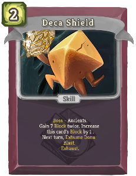 | 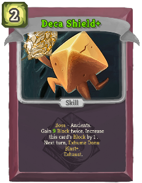 | Special | Skill | 2 | expansioncontent:Boss - Ancients. Gain 7 (9) Block twice. Increase this card's Block by 1. Next turn, expansioncontent:Exhume Donu Blast (*Blast+). Exhaust. |
| Automa-Beam | 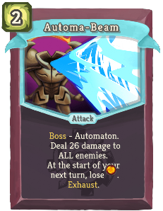 |  | Uncommon | Attack | 2 | expansioncontent:Boss - Automaton. Deal 26 (34) damage to ALL enemies. At the start of your next turn, lose [E]. Exhaust. |
| Awaken | 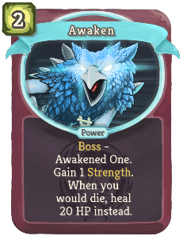 | 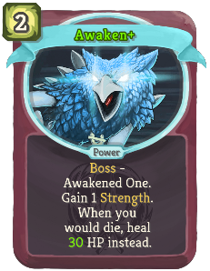 | Uncommon | Power | 2 | expansioncontent:Boss - Awakened One. Gain 1 Strength. When you would die, heal 20 (30) HP instead. |
| Chrono-Boost | 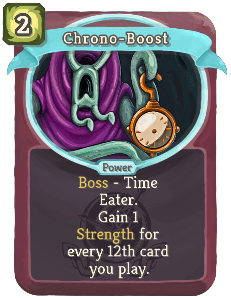 | 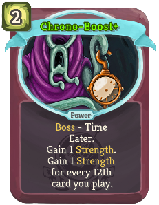 | Uncommon | Power | 2 | expansioncontent:Boss - Time Eater. Gain 1 Strength (. Gain 1 Strength) for every 12th card you play. |
| Donu Blast | 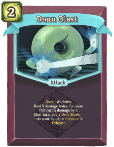 | 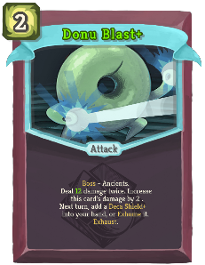 | Uncommon | Attack | 2 | expansioncontent:Boss - Ancients. Deal 9 (12) damage twice. Increase this card's damage by 2. Next turn, add a Deca Shield (*Shield+) into your hand, or expansioncontent:Exhume it. Exhaust. |
| Guardian Whirl | 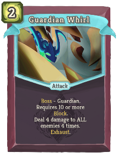 | 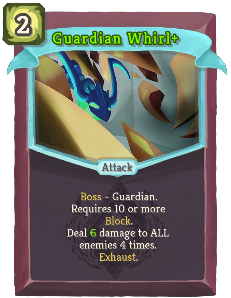 | Uncommon | Attack | 2 | expansioncontent:Boss - Guardian. Requires 10 or more Block. Deal 4 (6) damage to ALL enemies 4 times. Exhaust. |
| Hexaburn | 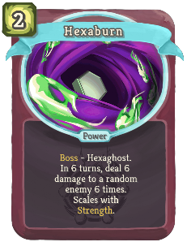 | 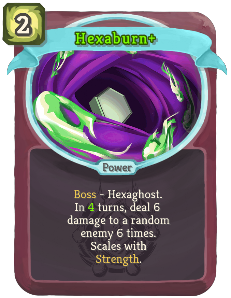 | Uncommon | Power | 2 | expansioncontent:Boss - Hexaghost. In 6 (4) turns, deal 6 damage to a random enemy 6 times. Scales with Strength. |
| Invincible | 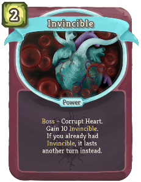 | 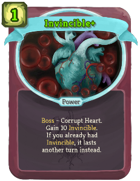 | Uncommon | Power | 2 (1) | expansioncontent:Boss - Corrupt Heart. Gain 10 expansioncontent:Invincible. If you already had expansioncontent:Invincible, it lasts another turn instead. |
| Last Stand | 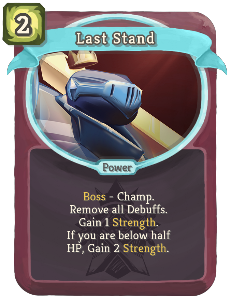 | 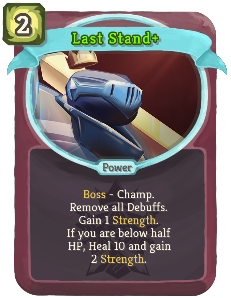 | Uncommon | Power | 2 | expansioncontent:Boss - Champ. Remove all Debuffs. Gain 1 Strength. If you are below half HP, Gain (Heal !M! and gain) 2 Strength. |
| Prepare Crush | 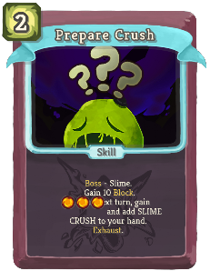 | 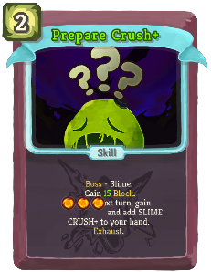 | Uncommon | Skill | 2 | expansioncontent:Boss - Slime. Gain 10 (15) Block. On your next turn, gain [E] [E] [E] and add SLIME CRUSH (CRUSH+) to your hand. Exhaust. |
| YOU ARE MINE! | 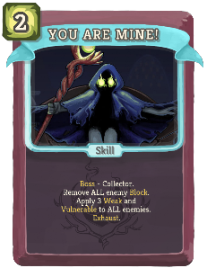 | 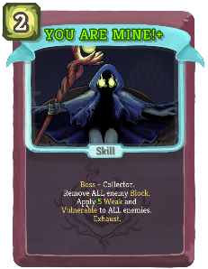 | Uncommon | Skill | 2 | expansioncontent:Boss - Collector. Remove ALL enemy Block. Apply 3 (5) Weak and Vulnerable to ALL enemies. Exhaust. |
| Quick Study | 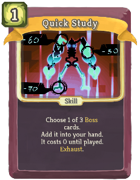 | 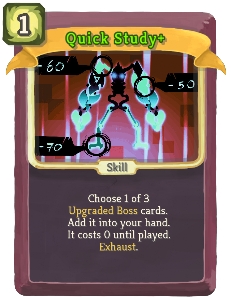 | Rare | Skill | 1 | Choose 1 of 3 (Upgraded) expansioncontent:Boss cards. Add it into your hand. It costs 0 until played. Exhaust. |
| Study the Spire | 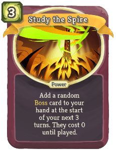 | 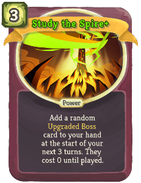 | Rare | Power | 3 | Add a random (Upgraded) expansioncontent:Boss card to your hand at the start of your next 3 turns. They cost 0 until played. |
| The Evil Within | 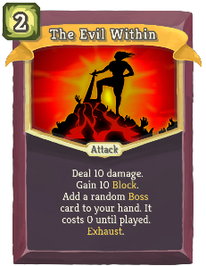 | 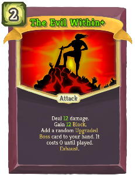 | Rare | Attack | 2 | Deal 10 (12) damage. Gain 10 (12) Block. Add a random (Upgraded) expansioncontent:Boss card to your hand. It costs 0 until played. Exhaust. |
