| Name | Image | Upgraded image | Rarity | Type | Cost | Description |
| ---- | ----- | -------------- | ------ | ---- | ---- | ----------- |
| Defend | 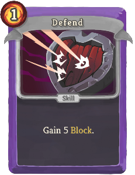 | 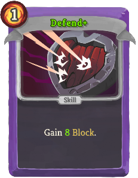 | Basic | Skill | 1 | Gain 5 (8) Block. |
| Gremlin Dance | 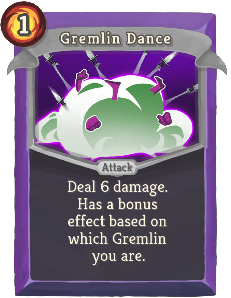 | 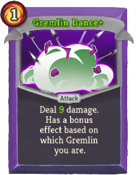 | Basic | Attack | 1 | Deal 6 (9) damage. Has a bonus effect based on which Gremlin you are. |
| Strike | 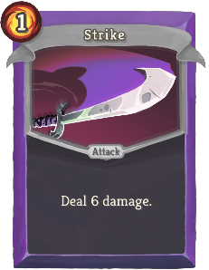 | 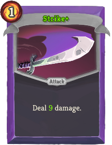 | Basic | Attack | 1 | Deal 6 (9) damage. |
| Tag Team | 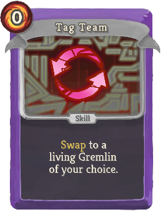 | 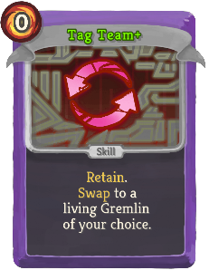 | Basic | Skill | 0 | (Retain.)  gremlin:Swap to a living Gremlin of your choice. |
| Bubble Barrier | 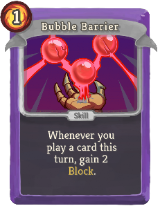 | 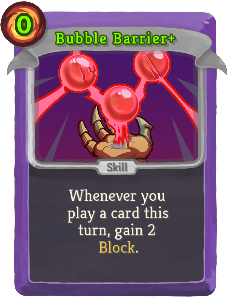 | Common | Skill | 1 (0) | Whenever you play a card this turn, gain 2 Block. |
| Bulk Up | 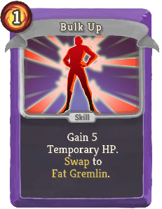 | 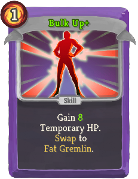 | Common | Skill | 1 | Gain 5 (8) Temporary HP. gremlin:Swap to gremlin:Fat_Gremlin. |
| Cat Scratch | 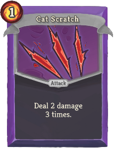 | 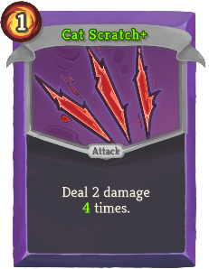 | Common | Attack | 1 | Deal 2 damage 3 (4) times. |
| Change-o! | 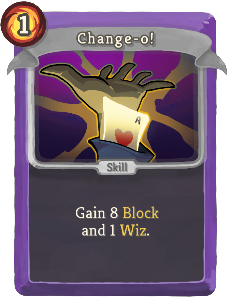 | 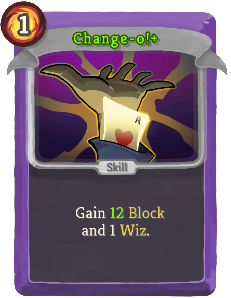 | Common | Skill | 1 | Gain 8 (12) Block and 1 gremlin:Wiz. |
| Dagger Dance | 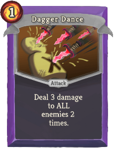 | 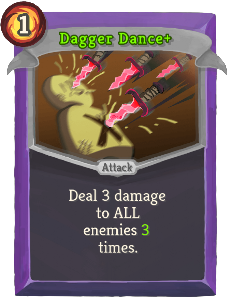 | Common | Attack | 1 | Deal 3 damage to ALL enemies 2 (3) times. |
| Flex | 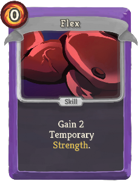 | 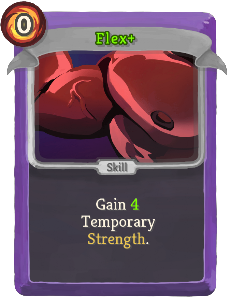 | Common | Skill | 0 | Gain 2 (4) Temporary Strength. |
| Glimmer | 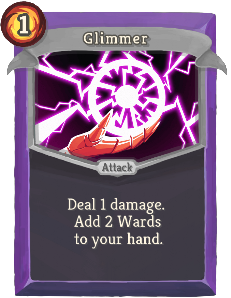 | 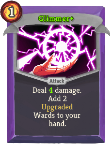 | Common | Attack | 1 | Deal 1 (4) damage. Add 2 (Upgraded) Wards to your hand. |
| Glitter Guard | 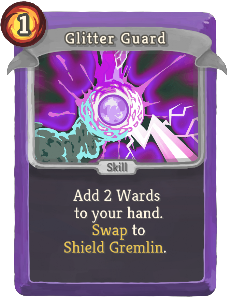 | 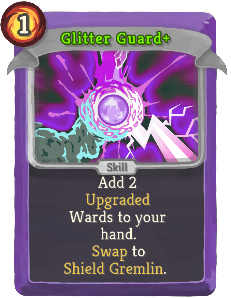 | Common | Skill | 1 | Add 2 (Upgraded) Wards to your hand. gremlin:Swap to gremlin:Shield_Gremlin. |
| Gremlin Arms | 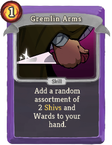 | 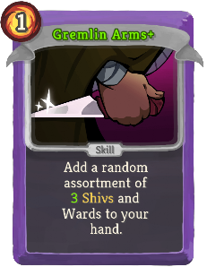 | Common | Skill | 1 | Add a random assortment of 2 (3) Shivs and Wards to your hand. |
| Irritability | 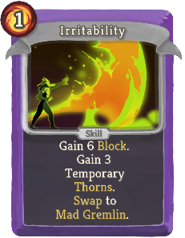 | 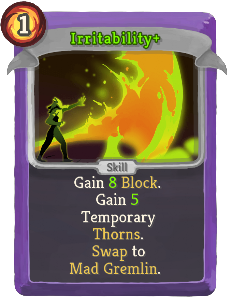 | Common | Skill | 1 | Gain 6 (8) Block. Gain 3 (5) Temporary Thorns. gremlin:Swap to gremlin:Mad_Gremlin. |
| Jeer | 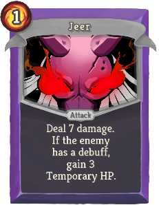 |  | Common | Attack | 1 | Deal 7 (11) damage. If the enemy has a debuff, gain 3 (4) Temporary HP. |
| Patsy | 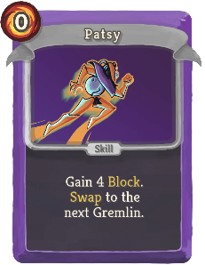 | 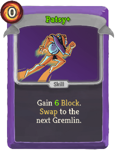 | Common | Skill | 0 | Gain 4 (6) Block. gremlin:Swap to the next Gremlin. |
| Pinprick | 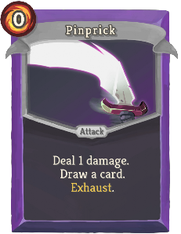 | 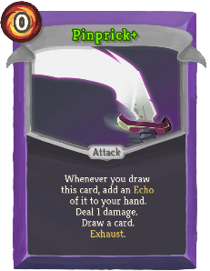 | Common | Attack | 0 | (Whenever you draw this card, add an gremlin:Echo of it to your hand.)  Deal 1 damage. Draw a card. Exhaust. |
| Pour Salt | 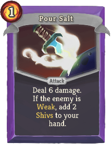 | 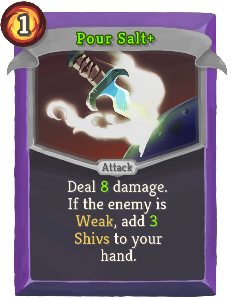 | Common | Attack | 1 | Deal 6 (8) damage. If the enemy is Weak, add 2 (3) Shivs to your hand. |
| Presto! | 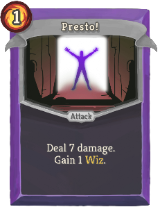 | 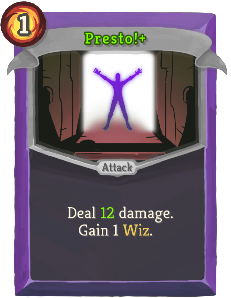 | Common | Attack | 1 | Deal 7 (12) damage. Gain 1 gremlin:Wiz. |
| Pretaliation | 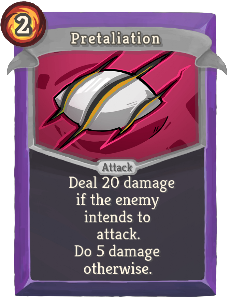 |  | Common | Attack | 2 | Deal 20 (27) damage if the enemy intends to attack. Do 5 damage otherwise. |
| Tadah! | 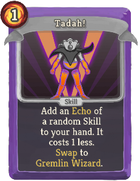 | 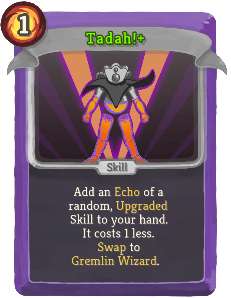 | Common | Skill | 1 | Add an gremlin:Echo of a random (, Upgraded) Skill to your hand. (NL) It costs 1 less. gremlin:Swap to gremlin:Gremlin_Wizard. |
| Toe Stub | 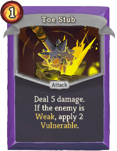 | 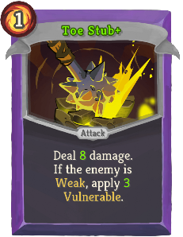 | Common | Attack | 1 | Deal 5 (8) damage. If the enemy is Weak, apply 2 (3) Vulnerable. |
| Tricksy |  | 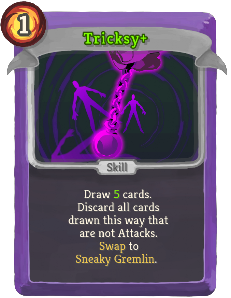 | Common | Skill | 1 | Draw 3 (5) cards. Discard all cards drawn this way that are not Attacks. gremlin:Swap to gremlin:Sneaky_Gremlin. |
| Twist The Knife | 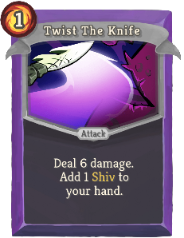 |  | Common | Attack | 1 | Deal 6 (9) damage. Add 1 (Upgraded) Shiv to your hand. |
| Aggressive Defense | 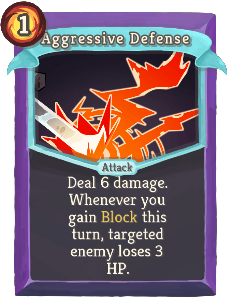 | 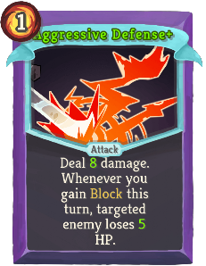 | Uncommon | Attack | 1 | Deal 6 (8) damage. Whenever you gain Block this turn, targeted enemy loses 3 (5) HP. |
| Arms Theft | 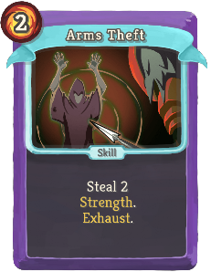 | 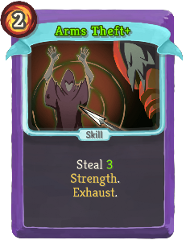 | Uncommon | Skill | 2 | Steal 2 (3) Strength. Exhaust. |
| Astound | 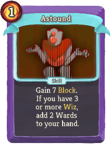 | 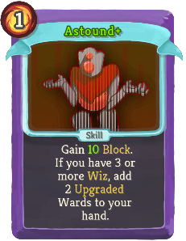 | Uncommon | Skill | 1 | Gain 7 (10) Block. If you have 3 or more gremlin:Wiz, add 2 (Upgraded) Wards to your hand. |
| Burly Blow |  |  | Uncommon | Attack | 2 | Deal 7 (9) damage for each stack of Weakened. (Always hits at least once.) |
| Counter Strike |  |  | Uncommon | Attack | 1 | Deal 8 (11) damage. If the enemy intends to attack, add 2 (Upgraded) Wards to your hand. |
| Dazzle |  |  | Uncommon | Attack | 1 | Deal 9 (13) damage. If you have 3 or more gremlin:Wiz, the enemy loses 2 Strength. Exhaust. |
| Edible Armor |  |  | Uncommon | Skill | 1 (0) | Convert your Block into Temporary HP. |
| Enthusiasm |  |  | Uncommon | Power | 1 (0) | Whenever you gremlin:Swap, draw a card. |
| Fan Of Knives |  |  | Uncommon | Attack | 1 | Deal 4 (5) damage. Add 1 (Upgraded) Shiv to your hand for each stack of gremlin:Wiz you have. |
| Feel The Audience |  |  | Uncommon | Attack | 1 | Deal 8 (11) damage to ALL enemies. Gain 1 gremlin:Wiz for each one that intends to attack. |
| Flurry |  |  | Uncommon | Attack | 1 (0) | Deal 3 damage for each card played this turn. Exhaust. |
| Follow Through |  |  | Uncommon | Attack | 1 | Deal 8 (11) damage. Gain 1 (2) Temporary Strength. |
| Gremlin Offensive |  |  | Uncommon | Attack | 1 | Deal 6 (9) damage. Add a (an Upgraded) Gremlin Offensive to your hand. Exhaust. |
| Gremlin Toss |  |  | Uncommon | Attack | 1 | (Gain !M! Temporary HP.)  Deal damage equal to your current Block and Temporary HP. |
| Heckle |  |  | Uncommon | Power | 3 (2) | Whenever you apply a debuff to an enemy, gain 2 Temporary HP. |
| Infinite Blocks |  |  | Uncommon | Power | 1 | (Innate.)  At the start of your turn, add a Ward to your hand. |
| Irksome Blow |  |  | Uncommon | Attack | 0 | Deal 1 damage. Irksome Blow is affected by Strength 4 (6) times. |
| Kablamo! |  |  | Uncommon | Attack | 2 | Deal 13 (17) damage to ALL enemies. This attack does not consume gremlin:Wiz. |
| Makeshift Armor |  |  | Uncommon | Power | 1 | (Gain !M! Artifact.)  Every time you play 7 attacks, gain 1 Artifact. |
| Mockery |  |  | Uncommon | Skill | 1 | Apply 1 (2) Weak. If the enemy has 3 or more Weak, gain 10 (14) Block. |
| Party Stick |  |  | Uncommon | Skill |  | Unplayable. Whenever you gremlin:Swap while this card is in your hand, gain [E] ([E]) |
| Pickpocket |  |  | Uncommon | Attack | 1 | Steal all Artifact. Deal 9 (13) damage. Exhaust. |
| Pin Needle |  |  | Uncommon | Attack | 1 | Deal 8 (11) damage. Shuffle 2 (Upgraded) Pinpricks into your draw pile. Exhaust. |
| Polish |  |  | Uncommon | Power | 1 | Shivs deal 2 (3) additional damage. Wards grant 2 (3) additional Block. |
| Proper Tools |  |  | Uncommon | Attack | 2 | Deal 6 (10) damage. If the enemy intends to attack, add 3 Wards to your hand. Otherwise, add 3 Shivs to your hand. |
| Rage Break |  |  | Uncommon | Skill | 2 | Double your Strength. Exhaust. (not Exhaust.) |
| Raid |  |  | Uncommon | Skill | 1 | Draw a card for each living Gremlin. Discard 2 (1) cards (card). |
| Revel |  |  | Uncommon | Skill | 3 (2) | Gain [E] for each living Gremlin. |
| Rhythm |  |  | Uncommon | Skill | 1 (0) | gremlin:Swap to the next Gremlin. Fetch a Basic card from your draw pile. It costs 0 this turn. |
| Scatter! |  |  | Uncommon | Skill | 2 (1) | The next time you would lose HP, instead gremlin:Swap to a random Gremlin. Exhaust |
| Shank Stone |  |  | Uncommon | Skill |  | Unplayable. Whenever you draw this card, add 2 (3) Shivs to your hand. |
| Sharpen Blades |  |  | Uncommon | Skill | 2 | (Draw a card.)  Reduce the cost of all Attacks in your hand to 0 this turn. |
| Show of Hands |  |  | Uncommon | Skill | 1 | (Draw a card.)  Gain 2 Block for every card in your hand. |
| Stupend |  |  | Uncommon | Attack | 1 | Gain 6 (8) Block. Deal 6 (8) damage. Block is affected by gremlin:Wiz. |
| Whiz |  |  | Uncommon | Skill | 1 | Gain 1 (2) gremlin:Wiz. Next turn, add (an Upgraded) Bang to your hand. Exhaust. |
| Wizardry |  |  | Uncommon | Power | 1 | (Innate.)  At the start of your turn, gain 1 gremlin:Wiz. |
| Broken Shin |  |  | Rare | Skill | 0 | Apply gremlin:Agony for every 4 (3) stacks of Weak the target has. |
| Conga Line |  |  | Rare | Power | 1 | (Innate.)  At the start of your turn, gain [E] and gremlin:Swap to the next Gremlin. |
| Duplicate |  |  | Rare | Skill | 2 | Make 2 gremlin:Echoes of an Attack in your hand. They cost 1 less. Exhaust. (not Exhaust.) |
| Encore |  |  | Rare | Power | 1 | Gain 3 gremlin:Wiz. Whenever you consume gremlin:Wiz, deal 5 (7) damage to ALL enemies. |
| Erupt |  |  | Rare | Skill | 1 | Gain 6 (9) Temporary Strength. Exhaust. |
| Exacerbate |  |  | Rare | Attack | 2 | Deal 8 (12) damage. gremlin:Cripple the enemy. Exhaust. |
| Fairy Dust |  |  | Rare | Skill | 0 | Add 2 (3) Wards to your hand and draw 2 (3) cards. Exhaust. |
| Flip Out |  |  | Rare | Attack | 1 | Deal 6 (9) damage to ALL enemies. Whenever you would gain Block this turn, instead deal that much damage to ALL enemies. |
| Fury |  |  | Rare | Attack | 3 | Costs 1 less [E] for every 2 Strength you have. Deal 7 (9) damage three times. |
| NOB |  |  | Rare | Power | 4 | Gain 20 (35) Temporary HP. Mutate into Gremlin Nob until you run out of Temporary HP. |
| Necromancy |  |  | Rare | Skill | 1 | Can only be played if you have 3 or more gremlin:Wiz. Consume all gremlin:Wiz to resurrect a random Gremlin with 10 (15) HP. Exhaust. |
| Second Volley |  |  | Rare | Attack | 2 | Deal 6 (8) damage. Add a (an Upgraded) Shiv to your hand for each card played this turn |
| Shadow Shiv |  |  | Rare | Power | 3 (2) | Whenever you play an Attack that doesn't Exhaust, add a Shiv to your hand. |
| Show Stopper |  |  | Rare | Attack | 0 | Can only be played if you have exactly 7 gremlin:Wiz. Deal 0 (2) damage to ALL enemies 5 times. |
| Target Wounds |  |  | Rare | Power | 1 | Deal 3 (5) additional damage to Weakened enemies. |
| Unforgiving |  |  | Rare | Power | 2 (1) | You cannot lose Strength. |
