| Name | Image | Upgraded image | Rarity | Type | Cost | Description |
| ---- | ----- | -------------- | ------ | ---- | ---- | ----------- |
| Defend | 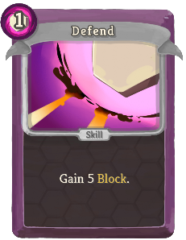 | 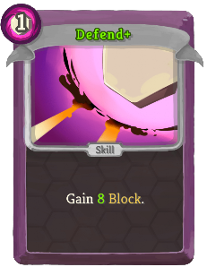 | Basic | Skill | 1 | Gain 5 (8) Block. |
| Float | 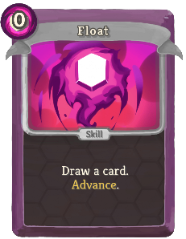 | 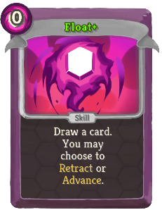 | Basic | Skill | 0 | Draw a card. (You may choose to hexamod:Retract or) hexamod:Advance. |
| Sear | 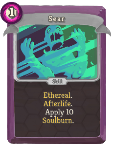 | 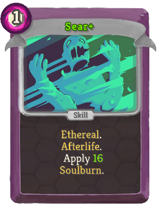 | Basic | Skill | 1 | Ethereal. hexamod:Afterlife. Apply 10 (16) hexamod:Soulburn. |
| Strike | 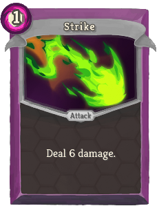 |  | Basic | Attack | 1 | Deal 6 (9) damage. |
| Advancing Guard | 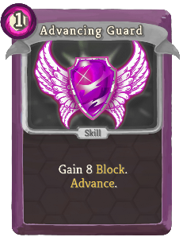 | 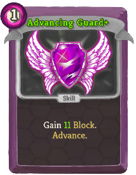 | Common | Skill | 1 | Gain 8 (11) Block. hexamod:Advance. |
| Backtrack Smack | 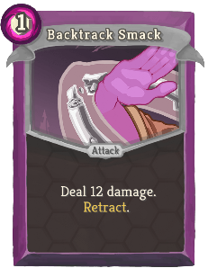 | 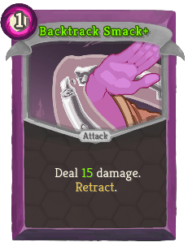 | Common | Attack | 1 | Deal 12 (15) damage. hexamod:Retract. |
| Burning Touch | 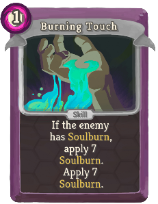 | 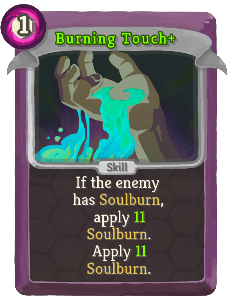 | Common | Skill | 1 | If the enemy has hexamod:Soulburn, apply 7 (11) hexamod:Soulburn. Apply 7 (11) hexamod:Soulburn. |
| Divider | 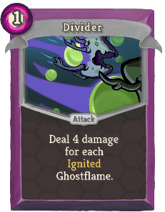 | 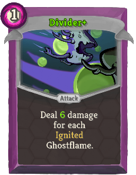 | Common | Attack | 1 | Deal 4 (6) damage for each hexamod:Ignited Ghostflame. |
| Fast Forward |  | 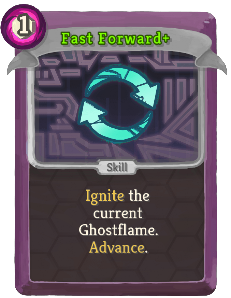 | Common | Skill | 1 | Ethereal. (not Ethereal.) hexamod:Ignite the current Ghostflame. hexamod:Advance. |
| Firestarter |  | 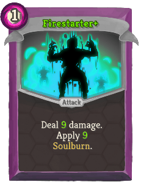 | Common | Attack | 1 | Deal 7 (9) damage. Apply 7 (9) hexamod:Soulburn. |
| Flames from Beyond | 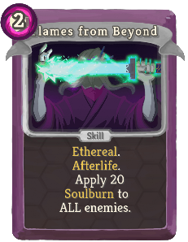 | 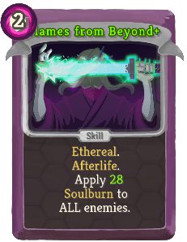 | Common | Skill | 2 | Ethereal. hexamod:Afterlife. Apply 20 (28) hexamod:Soulburn to ALL enemies. |
| Ghost Lash | 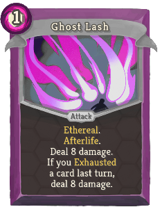 | 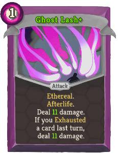 | Common | Attack | 1 | Ethereal. hexamod:Afterlife. Deal 8 (11) damage. If you Exhausted a card last turn, deal 8 (11) damage. |
| Ghost Shield | 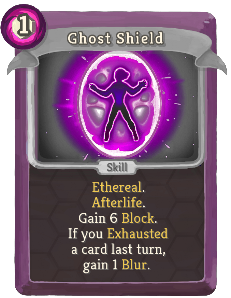 | 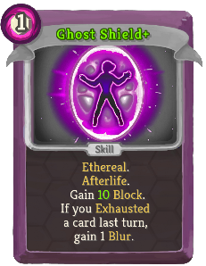 | Common | Skill | 1 | Ethereal. hexamod:Afterlife. Gain 6 (10) Block. If you Exhausted a card last turn, gain 1 bronze:Blur. |
| Haunting Echo | 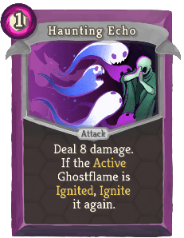 | 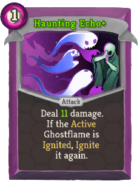 | Common | Attack | 1 | Deal 8 (11) damage. If the hexamod:Active Ghostflame is hexamod:Ignited, hexamod:Ignite it again. |
| Heat Metal | 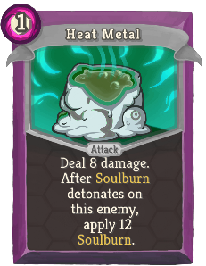 | 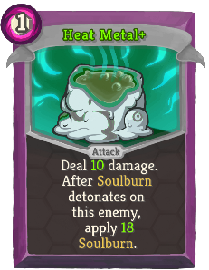 | Common | Attack | 1 | Deal 8 (10) damage. After hexamod:Soulburn detonates on this enemy, apply 12 (18) hexamod:Soulburn. |
| Hexaguard | 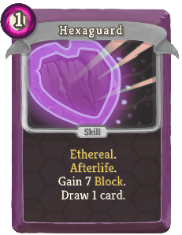 |  | Common | Skill | 1 | Ethereal. hexamod:Afterlife. Gain 7 (10) Block. Draw 1 card. |
| Shield of Night | 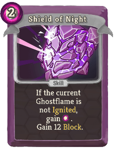 | 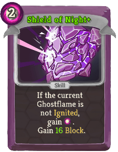 | Common | Skill | 2 | If the current Ghostflame is not hexamod:Ignited, gain [E] . Gain 12 (16) Block. |
| Specter's Wail | 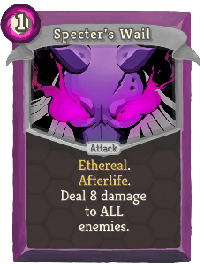 | 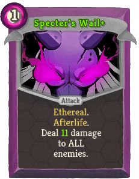 | Common | Attack | 1 | Ethereal. hexamod:Afterlife. Deal 8 (11) damage to ALL enemies. |
| Stoke the Fire | 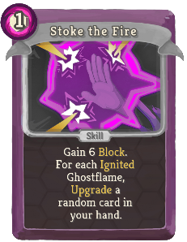 |  | Common | Skill | 1 | Gain 6 (9) Block. For each hexamod:Ignited Ghostflame, Upgrade a random card in your hand. |
| Strike From Beyond | 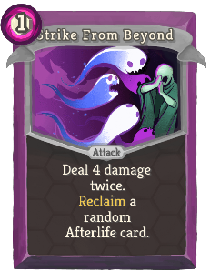 | 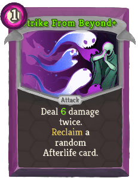 | Common | Attack | 1 | Deal 4 (6) damage twice. expansioncontent:Reclaim a random Afterlife card. |
| Sword of Night | 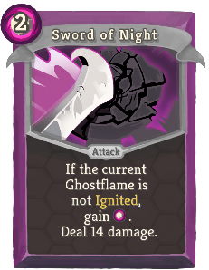 |  | Common | Attack | 2 | If the current Ghostflame is not hexamod:Ignited, gain [E] . Deal 14 (18) damage. |
| Thermal Transfer | 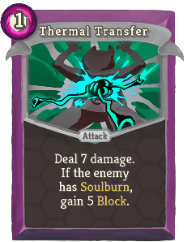 | 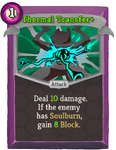 | Common | Attack | 1 | Deal 7 (10) damage. If the enemy has hexamod:Soulburn, gain 5 (8) Block. |
| Again! | 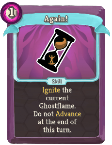 | 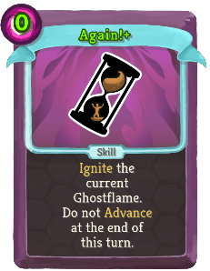 | Uncommon | Skill | 1 (0) | hexamod:Ignite the current Ghostflame. Do not hexamod:Advance at the end of this turn. |
| Bright Ritual | 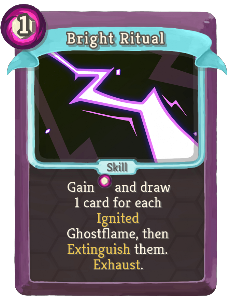 | 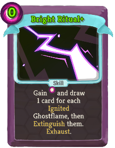 | Uncommon | Skill | 1 (0) | Gain [E] and draw 1 card for each hexamod:Ignited Ghostflame, then hexamod:Extinguish them. Exhaust. |
| Catch Up | 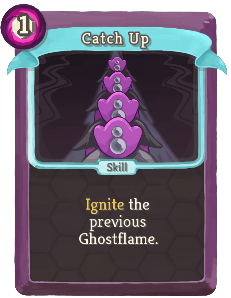 | 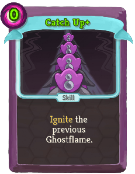 | Uncommon | Skill | 1 (0) | hexamod:Ignite the previous Ghostflame. |
| Charged Barrage | 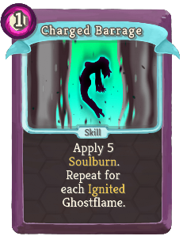 | 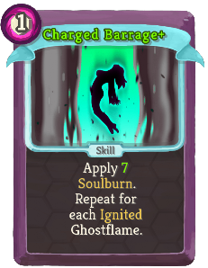 | Uncommon | Skill | 1 | Apply 5 (7) hexamod:Soulburn. Repeat for each hexamod:Ignited Ghostflame. |
| Devil's Dance |  | 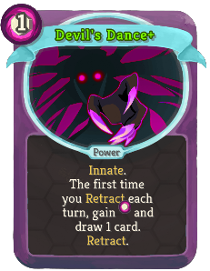 | Uncommon | Power | 1 | (Innate.)  The first time you hexamod:Retract each turn, gain [E] and draw 1 card. hexamod:Retract. |
| Eerie Expedition | 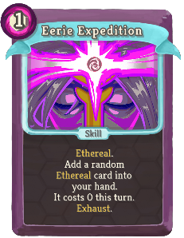 | 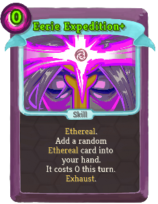 | Uncommon | Skill | 1 (0) | Ethereal. Add a random Ethereal card into your hand. It costs 0 this turn. Exhaust. |
| Empowered Flame | 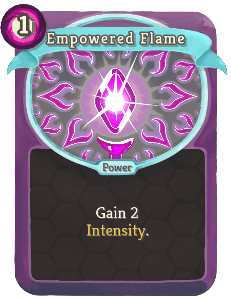 |  | Uncommon | Power | 1 | Gain 2 (3) hexamod:Intensity. |
| Extra Crispy |  |  | Uncommon | Power | 1 | (Innate.)  Cards and Ghostflames apply 2 more hexamod:Soulburn. |
| First Seal |  |  | Uncommon | Power | 1 | Ethereal (not Ethereal)hexamod:Seal. At the end of combat, heal 7 HP. |
| Floatwork |  |  | Uncommon | Power | 1 | (Innate.)  Ethereal. hexamod:Afterlife. Gain 1 Dexterity. |
| Fourth Seal |  |  | Uncommon | Power | 1 | Ethereal (not Ethereal)hexamod:Seal. At the end of combat, gain an additional Potion reward. |
| Ghostflame Wall |  |  | Uncommon | Skill | 2 | Gain 12 (16) Block. Whenever you are attacked this turn, apply 4 (6) hexamod:Soulburn to the attacker. |
| Haunted Hand |  |  | Uncommon | Skill | 0 | Ethereal. hexamod:Afterlife. Draw 2 (3) cards. All cards in your hand become Ethereal. Exhaust. |
| Heat Crush |  |  | Uncommon | Attack | 3 | Deal 20 (30) damage. Damage is increased by enemy's hexamod:Soulburn. |
| Heat Shield |  |  | Uncommon | Skill | 2 | Ethereal. (not Ethereal.) Gain 5 Block, increased by hexamod:Soulburn on ALL enemies. |
| Incineration |  |  | Uncommon | Attack | 2 | Deal 4 damage and apply 4 hexamod:Soulburn to a random enemy 3 (4) times. |
| Incorporeal |  |  | Uncommon | Skill | 0 | hexamod:Retract. Lose 6 (3) HP. Gain 1 Intangible. Exhaust. |
| Living Bomb |  |  | Uncommon | Skill | 0 | Apply 5 hexamod:Soulburn. The next time the target's hexamod:Soulburn detonates, it affects ALL enemies. Exhaust. (not Exhaust.) |
| Nightmare Guise |  |  | Uncommon | Skill | 1 | Ethereal. Gain 9 (13) Block. If this card is Exhausted, add a Shadow Guise into (*Guise+ to) your hand. |
| Nightmare Strike |  |  | Uncommon | Attack | 1 | Ethereal. Deal 10 (14) damage. If this card is Exhausted, add a Shadow Strike into (*Strike+ to) your hand. |
| Nightmare Vision |  |  | Uncommon | Skill | 0 | expansioncontent:Exhume an (2) Ethereal card(s). Exhaust. |
| Phantom Fireball |  |  | Uncommon | Attack | 1 | Deal 8 (11) damage. If the enemy has hexamod:Soulburn, detonate it. |
| Power from Beyond |  |  | Uncommon | Skill | 1 | Ethereal. hexamod:Afterlife. Gain [E] and draw 1 (2) card(s) next turn. |
| Radiant Flame |  |  | Uncommon | Power | 1 | Whenever you hexamod:Ignite a Ghostflame, apply 3 (5) hexamod:Soulburn to a random enemy. |
| Rain of Embers |  |  | Uncommon | Attack | X | Deal 7 (8) damage and apply 7 (8) hexamod:Soulburn to a random enemy X times. If X is 3 or more, apply 1 (2) Weak and Vulnerable to ALL enemies. |
| Rewind |  |  | Uncommon | Skill | 0 | hexamod:Retract. Gain [E] (and draw 1 card). |
| Second Seal |  |  | Uncommon | Power | 1 | Ethereal (not Ethereal)hexamod:Seal. At the end of combat, gain 8 additional Gold. |
| Skip a Beat |  |  | Uncommon | Skill | 1 (0) | hexamod:Ignite the next Ghostflame. Exhaust. |
| Spectral Spark |  |  | Uncommon | Skill | 0 | Apply 6 (9) hexamod:Soulburn. If the current Ghostflame is hexamod:Ignited: hexamod:Extinguish it and return this card to your hand. |
| Speedrunning |  |  | Uncommon | Power | 1 | Whenever you hexamod:Advance, gain 2 (3) Block. |
| Step Through |  |  | Uncommon | Attack | 1 | Deal 8 (11) damage. Draw 1 card for each hexamod:Ignited Ghostflame. |
| Third Seal |  |  | Uncommon | Power | 1 | Ethereal (not Ethereal)hexamod:Seal. At the end of combat, gain an additional card reward. |
| Worthy Sacrifice |  |  | Uncommon | Skill | 0 | Choose an Attack or Skill to Exhaust. Add a random card of the opposite type into your hand.  (It costs 1 less.) |
| Bad Omen |  |  | Rare | Skill | 1 | Ethereal (Retain). Replace the current Ghostflame with a hexamod:Crushing or hexamod:Bolstering one. Exhaust. |
| Burning Question |  |  | Rare | Skill | 1 | Ethereal. Gain 10 (12) Block. Increase this card's damage by 8 (10). When this card is Exhausted, deal 10 (12) damage to ALL enemies. |
| Doomsday |  |  | Rare | Power | 0 | The next time you hexamod:Ignite the Inferno Ghostflame and all (at least) 6 (5) Ghostflames are hexamod:Ignited, take an extra turn. |
| Fifth Seal |  |  | Rare | Power | 2 | Ethereal (not Ethereal)hexamod:Seal. At the end of combat, Upgrade a random card in your deck. |
| Forked Flame |  |  | Rare | Attack | 1 | Deal 7 damage. hexamod:Ignite the previous, then the (current, then the) next Ghostflames. |
| Gifts From Beyond |  |  | Rare | Power | 2 (1) | At the start of your turn, expansioncontent:Reclaim a random Afterlife card. |
| Here and Now |  |  | Rare | Power | 1 | If you start and end your turn with the same Ghostflame active, gain 1 (2) Strength. |
| Infernal Form |  |  | Rare | Power | 3 (2) | At the start of your turn, gain 1 hexamod:Intensity. |
| Instant Inferno |  |  | Rare | Skill | 1 | Retain. hexamod:Ignite the (current Ghostflame. hexamod:Ignite the) Inferno Ghostflame. Exhaust. |
| Poltergeist |  |  | Rare | Power | 2 | Whenever you play an Afterlife card, deal 6 (9) damage to a random enemy. |
| Premonition |  |  | Rare | Skill | 1 (0) | Choose a card in your hand. Play the chosen card and Exhaust it. Exhaust. |
| Searing Wound |  |  | Rare | Skill | 1 | ALL enemies lose HP equal to their hexamod:Soulburn. Exhaust. (not Exhaust.) |
| Sixth Seal |  |  | Rare | Power | 3 | Ethereal (not Ethereal)hexamod:Seal. At the end of combat, gain an additional non-Sixth Seal card reward. |
| Time Warp |  |  | Rare | Attack | 0 | Deal 4 (6) damage. Whenever you hexamod:Advance or hexamod:Retract, return this from the discard pile to your hand. |
| Time of Need |  |  | Rare | Skill | 1 (0) | Retain. Add a random Power card into your hand. It costs 0 until played. Exhaust. |
| Toasty! |  |  | Rare | Attack | 2 | Deal 14 (18) damage. Apply hexamod:Soulburn equal to unblocked damage dealt. |
| Turn It Up |  |  | Rare | Skill | X | Gain 6 hexamod:Intensity. Lose it in X+1 turns. (Gain [E].)  Exhaust. |
| Unleash Spirits |  |  | Rare | Attack | 2 | Deal 6 (8) damage to a random enemy. Repeat for each Ethereal card in your exhaust pile. Exhaust. |
| Unlimited Power |  |  | Rare | Skill | 5 (4) | hexamod:Ignite all Ghostflames in order. Exhaust. |
| Volcano Visage |  |  | Rare | Power | 1 | At the start of your turn, apply 4 (6) hexamod:Soulburn to ALL enemies. |
